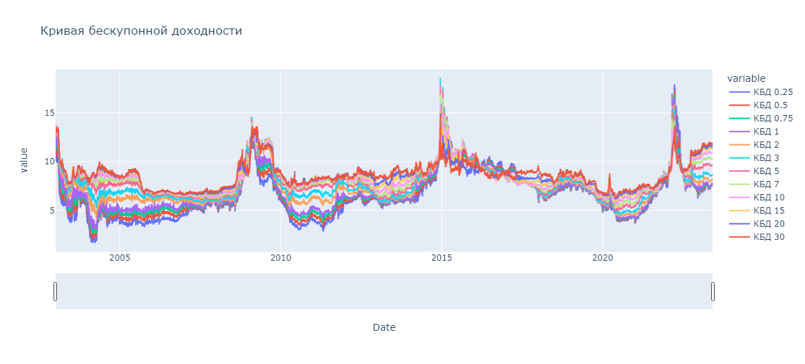

# Data
To open interactive data visualization with plotly (express and Dash) run [`RM_project2_PCA.ipynb`](RM_project2_PCA.ipynb) or download [`/results/yield_curve_with_slider.html`](../results/yield_curve_with_slider.html) and/or [`/results/pca_with_slider.html`](../results/pca_with_slider.html) and open manually.

### Example screenshots of visualizations:
Yield curves:

Dash app 1. Get yield curve for a selected date.

Dash app 2. Get mean yield curve for a selected year.

# PCA
With PCA decomposition latent factors of yield curve are derived:
- level
- slope
- curvature

Example screenshot of plotly visualization (see [`results/pca_with_slider.html`](../results/pca_with_slider.html)).

# Modelling
Model yield curves with:
- stochastic models (see [`stoch_models.py`](stoch_models.py), for more details see [project 1](https://github.com/quynhu-d/hse_risk_management_1))
- SARIMAX
