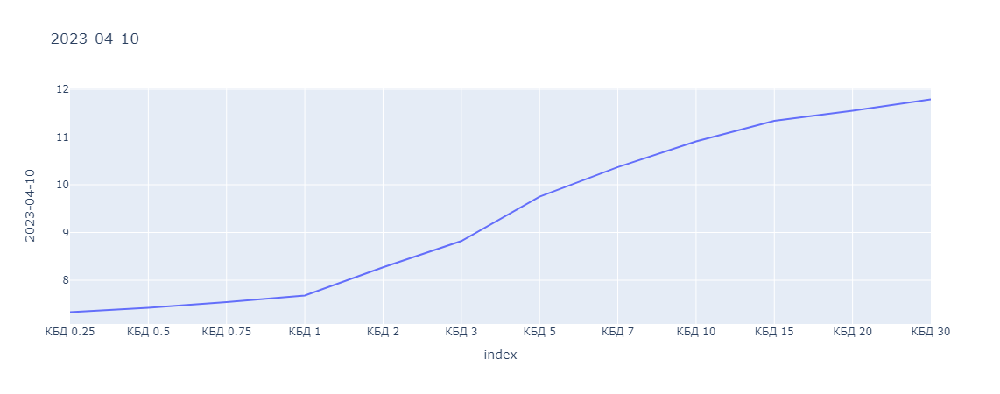
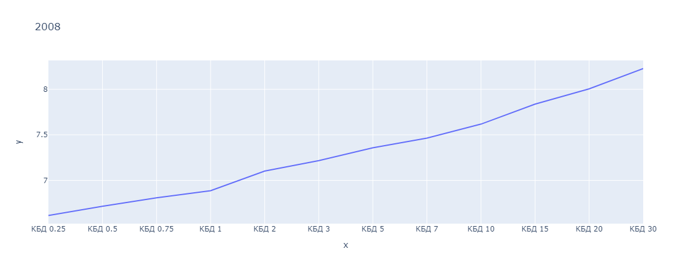
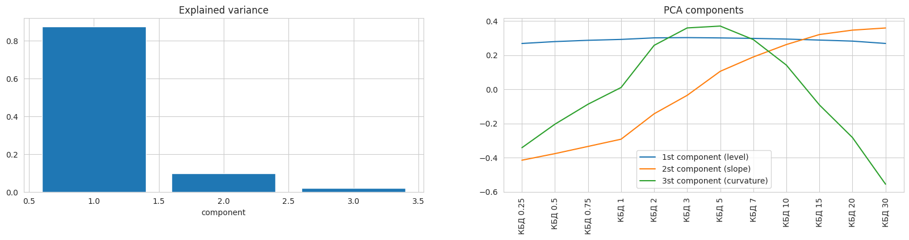

# Data
To open interactive data visualization with plotly Dash run [`RM_project2_PCA.ipynb`](RM_project2_PCA.ipynb).

html visualizations:
- [yield curves](https://htmlpreview.github.io/?https://github.com/quynhu-d/hse_risk_management_2/blob/main/results/yield_curve_with_slider.html)
- [pca components](https://htmlpreview.github.io/?https://github.com/quynhu-d/hse_risk_management_2/blob/main/results/pca_with_slider.html)

Or you can download [`/results/yield_curve_with_slider.html`](../results/yield_curve_with_slider.html) or [`/results/pca_with_slider.html`](../results/pca_with_slider.html) and open manually.

### Example screenshots of plotly visualizations:
Yield curves [(interactive version)](https://htmlpreview.github.io/?https://github.com/quynhu-d/hse_risk_management_2/blob/main/results/yield_curve_with_slider.html):

Dash app 1. Get yield curve for a selected date.

Dash app 2. Get mean yield curve for a selected year.

# PCA
See [`RM_project2_PCA.ipynb`](RM_project2_PCA.ipynb).

With PCA decomposition latent factors of yield curve are derived:
- level
- slope
- curvature

Example screenshot of plotly visualization [(interactive version)](https://htmlpreview.github.io/?https://github.com/quynhu-d/hse_risk_management_2/blob/main/results/pca_with_slider.html):

# Modelling
See [`RM_project2_model.ipynb`](RM_project2_model.ipynb).

Model yield curves with:
- stochastic models (see [`stoch_models.py`](stoch_models.py), for more details see [project 1](https://github.com/quynhu-d/hse_risk_management_1))
- SARIMAX
